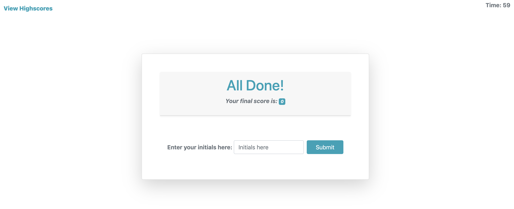

# Code Quiz !

## Code Quiz description

`This project hosts the source code for my Java Script Code Quiz. Timed quiz JavaScript fundamentals that stores high scores.`

### The following animation demonstrates the application functionality:





## Installing / Getting Started

To test this project, simply clone project into a your local file system and open `index.html` in your favorite browser.

```
git clone https://github.com/ystamaritq/code-quiz.git
cd code-quiz
open index.html

```

---

### Initial Configuration

No additional setup required.

## Developing

Below is a summary of the key files for this project and their purpose:

- **index.html** code quiz html page
- **assets** folder that contains all files
- **assets/js/script.js** javascript files
- **assets/img/..** images used by the page
- **assets/css/reset** reset css used by the page
- **assets/css/style.css** main site custom stylesheet

## Additional Libraries:

- **Bootstrap**

## Features

In this java script quiz once you click the start button you will be presented with a series of multiple choice questions and you have only 60 seconds to finish.

## Licensing

"The code in this project is licensed under MIT license."

---

**developed with love by **@ystamaritq\*\*\*\*
